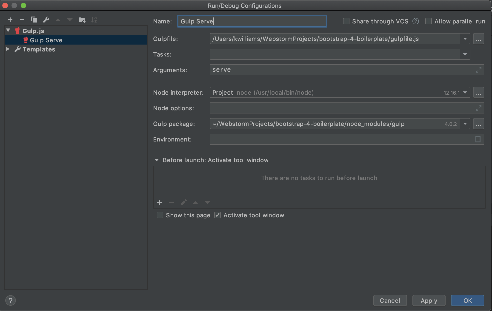

# Repository Description
These are a series of projects to help you learng SASS(SCSS), BrowserSync, GULP, GitHub Pages, and web templates 
with partial html files.  When you complete this project, you will be able to build your portfolios website.
## Assignments
* [Assignment 1 Here](BootStrapBrowserSyncGulp-Homework.pdf)
* [Assignment 2 Here](BootstrapIntroduction.pdf)

#  Videos
* [Video 1 - Introduction Project Setup](https://youtu.be/rusniDSzXGs)
* [Video 2 - Boootstrap Tables and Layout](https://youtu.be/5vVfAyUgjg0)
* [Video 3 - Boootstrap Carousel of Z-Layout](https://youtu.be/uoNYzWw5_Js)
* [Video 4 - Bootstrap Bottom of Z-Layout](https://youtu.be/hOZb45fZYyE)

# Prerequisites
1. Install Node.js
2. Read the Gulp article to explain how to install Gulp globally i.e. npm install -g npm install gulp-cli -g on windows or sudo install -g npm install gulp-cli -g on mac

# Install Instructions
1.  Clone the repository in WebStorm
2.  Run npm install to install the dependencies
3.  Add a run configuration for "Gulp" and put in "serve" as an argument

# Readings
* [What is Bootstrap?](https://www.tutorialrepublic.com/twitter-bootstrap-tutorial/)
* [What is GULP? <- You need to follow this or it won't work](https://www.sitepoint.com/introduction-gulp-js/)
* [What is Browser Sync?](https://torquemag.io/2017/06/automate-workflow-browsersync/)
* [What is SASS CSS(SCSS)?](https://sass-lang.com/guide)
* [What are Partial Templates?](https://github.com/xkxd/gulp-html-partial)

# Useful Links
* [Bootstrap Components](https://getbootstrap.com/2.3.2/components.html)
* [Gulp Homepage](https://gulpjs.com)
* [Browser Sync Homepage](https://browsersync.io)
* [SCSS Homepage](https://sass-lang.com/guide)
* [Markdown Cheat Sheet Reference](https://github.com/adam-p/markdown-here/wiki/Markdown-Cheatsheet)